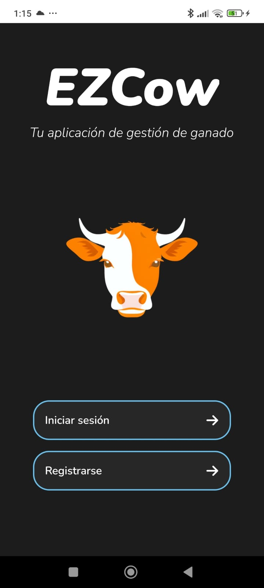
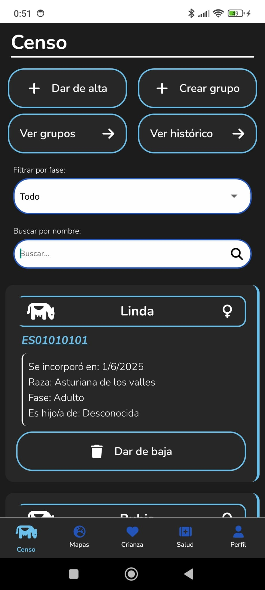

# EZCow

### Description
EZCow is a mobile application that allows users to manage their livestock and grazings. It provides a user-friendly interface for managing livestock, including the ability to add, edit, and delete livestock, as well as manage grazings and pasture areas. The application also includes features for tracking the status of livestock and managing the grazing process, check the reproduction and health calendars and a lot of more features!

EZCow is designed to be user-friendly and intuitive, with a clean and modern interface that makes it easy to navigate and use. The objective is to help the farmers and the primary sector. 🐄🤍

### Preview

### Installation
You can clone the zip file and install it on your phone or simulator. But I recommend to install the APK file from the following link:

